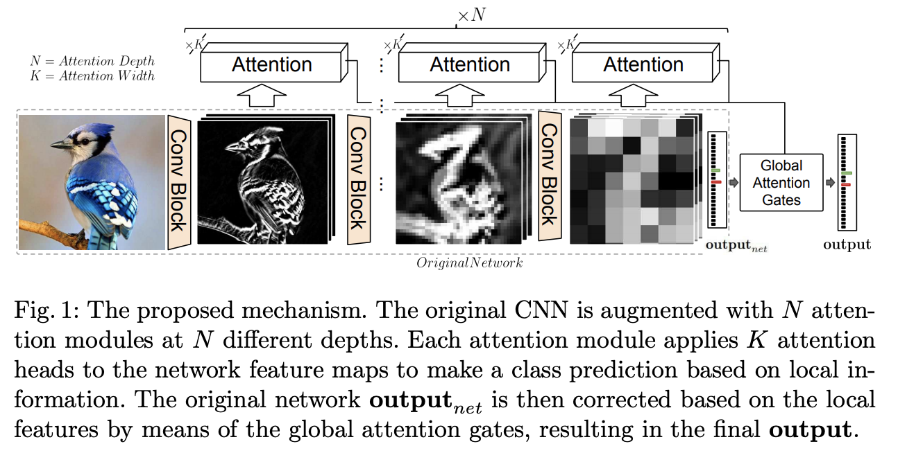
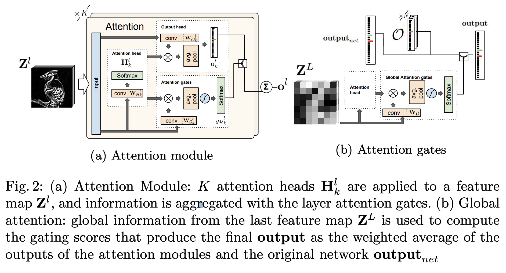
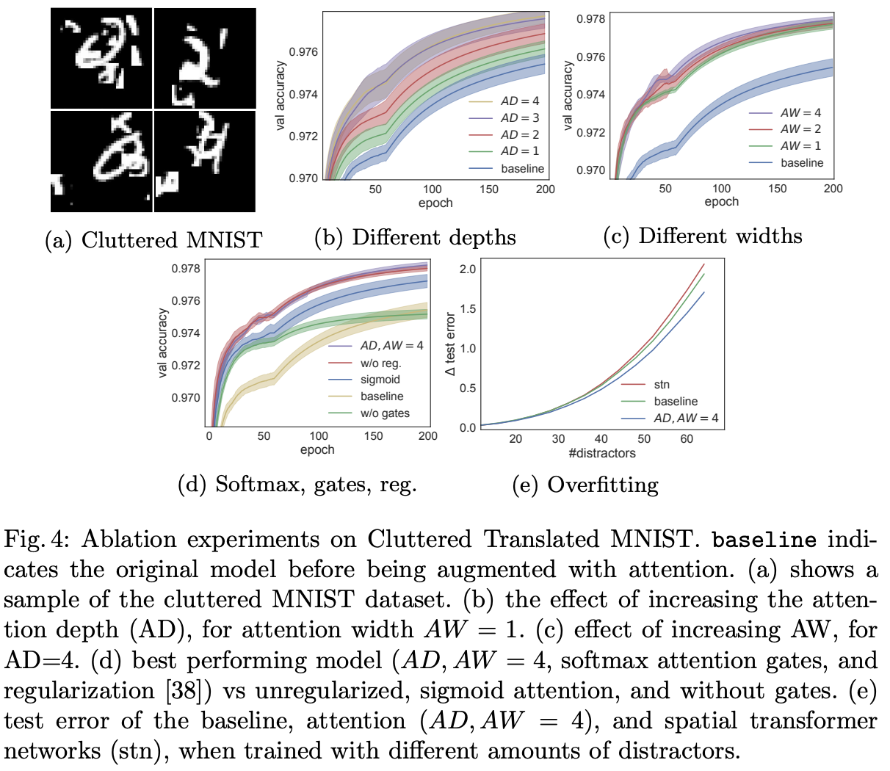
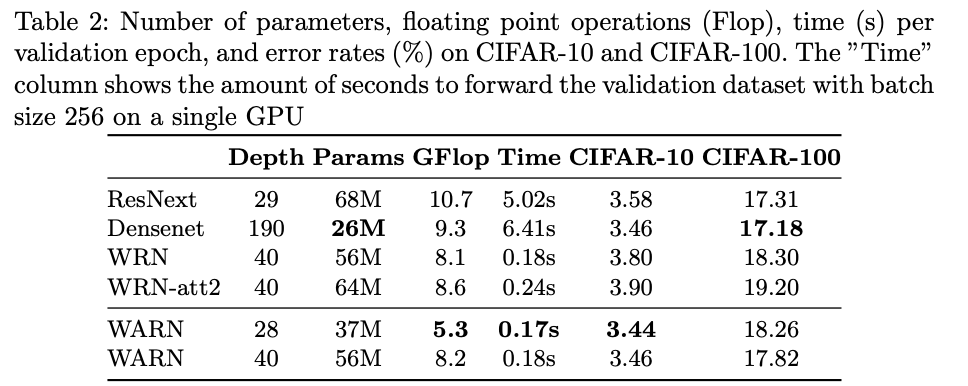
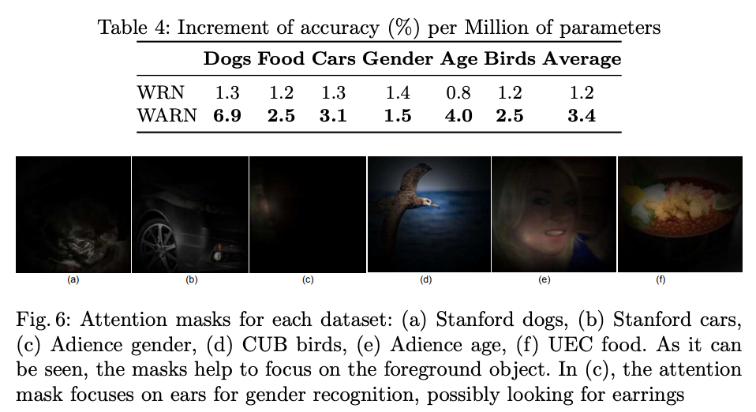

**Paper link : https://eccv2018.org/openaccess/content_ECCV_2018/papers/Pau_Rodriguez_Lopez_Attend_and_Rectify_ECCV_2018_paper.pdf**

작성자 github : https://github.com/prlz77/attend-and-rectify

## 요약

기존 CNN 구조에 Attention을 도입하여서 fine-grained recognition을 실현하는 방법에 대한 논문.

CNN의 각 단계별로 Attention을 도입을 하여, 예축 class에 대한 confidence를 생성하고 각 attention 별로 가중치를 부여하여 최종 classification과 결합함.

 

#### 해당 논문의 장점

* 각  attention에 대한 구조가 동일하기 때문에 모듈화 가능
* 모든 CNN 구조에 적용 가능
* 필요한 메모리 계산 비용이 적음
* 구현이 간단

## 방법

논문에서 attention 모듈은 3가지의 서브 모듈로 이루어져 있음

* attention head $$\mathcal{H}$$ : feature map에서 conv, softmax를 이용해서 K개의 attention map을 생성, feature map에서 가장 연관된 지역을 정의
* output head $$\mathcal{O}$$ : feature map과 attention map을 사용해서 hypothesis를 생산 
* confidence gates $$\mathcal{G}$$ : 여러 attention head에 대한 신뢰도를 생성

  

### Attention Head 

해당 CNN 레이어에서 k개의 attention map을 생성하게 됨, 

1. 인풋으로 l개 채널 이미지가 들어옴
2. k개의 conv를 하고 softmax를 함
3. k개의 attentin mask
4. (K * h * w ) 의 output을 생성하게 됨

 

​		$$H^l = spatial\_softmax(W_{\mathcal{H}^l} * Z^l)$$

 

### Output Head

1. feature map을 인풋으로 label 개수 만큼으로 만드는 conv
2. label * h * w 가 k개 만큼 있음
3. attention head랑 element-wise product -> 하고 piexel 별로 sum
4. avg pooling을 사용해서 output에 대한 hypothesis를 생성

 

​		$$O^l_k = W_{\mathcal{O}_k^l} * Z^l.$$

​		$$o^l_k = \sum_{x,y}\mathcal{H}_k^l \odot O^l_k$$

 

### Layered Attention gates

각 attention 레이어의 아웃풋인 output $$ o^l $$ 은 k개의 output probabilty vector의 weighted average로 생성됨

​		$$o^l = \sum_k g_{\mathcal{H}^l_k}o^l_k$$

output head로 부터 생성된 k개의 output head의 probabilty vector에 대하여 가중치를 계산하는 부분

​		$$\sum_k g_{\mathcal{H}^l_k} = 1$$, 을 만족하도록 softmax를 취하여 각 output head의 hypothesis를 합친 $$ o^{l}$$의 값이 커지지 않도록 함

1. conv를 $$|\mathcal{H}|$$개 만큼 후 
2. attention head의 결과와 합친 후
3. avg pool을 해줌
4. tanh를 한번 해준 뒤 softmax를 취해서 sum이 1이 될 수 있도록 함

 

​		$$g_{\mathcal{H}^l} = softmax(tanh(\sum_{x,y}(W^l_g * Z^l)\odot H_l))$$

 

각 레이어 별로 attention gate(attention head별 confidence 값) 값을 기반으로 output head의 결과를 weighted sum.

​		$$o^l = \sum_k g_{\mathcal{H}^l_k}o^l_k$$

### Global Attention gates

각 레이어에서 진행한 hypothesis를 최종으로 합치는 부분, 위 그림의 (B) 부분으로 최종 CNN에서 feature map에서 attention head만 사용을 하여서 이전에 만든 (N개의 $$o^l$$  + 최종 $$output_{net}$$) -> N+1 에 대한 weight를 생성한다.

 

N개의 각 단계에서 얻은 hypothesis와 최종 output에 대하여 Global attention gates에서 얻은 신뢰도를 이용하여 최종 hypothesis를 생성한다.

​		$$output = g_{net} · output_{net} + \sum_{ l∈\{1..|O|\}} g^l_O · o^l ,$$

 

## Experiments

### Ablation 

Ablation experiment를 해서, AD,AW등 하이퍼파라미터를 결정

### 실험 결과 

Wide-ResNet을 Baseline으로 사용하여 실험

* 대부분 연산이 1*1 conv 랑 pooling등 간단한 연산으로 attention을 구축하여서 적은 연산량 증가가 되지만, 성능은 cifar-10,100에 대하여 증가함
* attention mask에 대하여 시각화한 결과도 있음, 배경은 무시하고, 분류에 필요한 부분만 집중한다고 볼 수 있다고 함